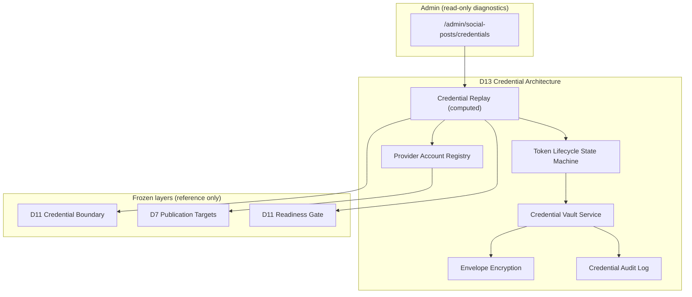
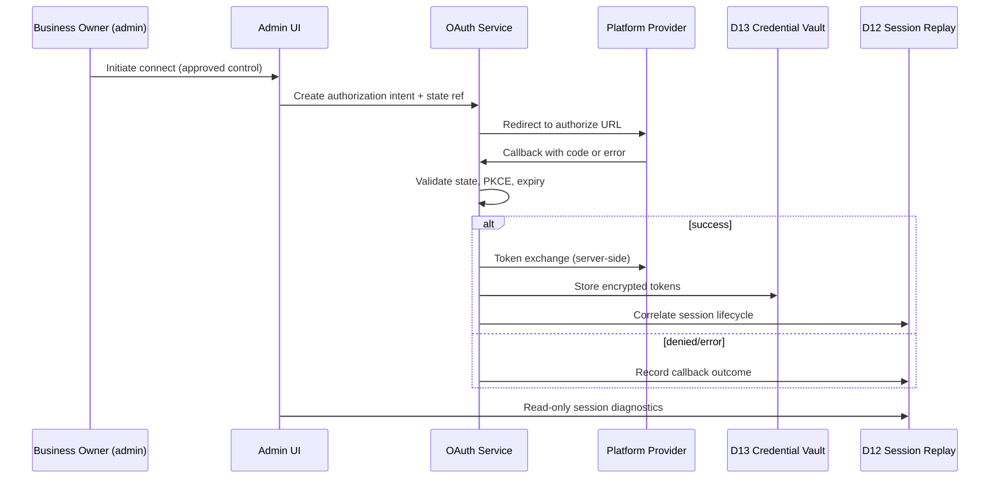
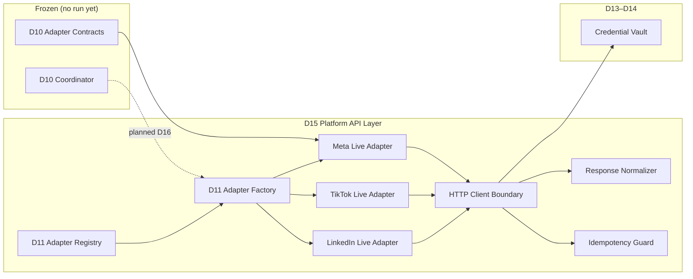
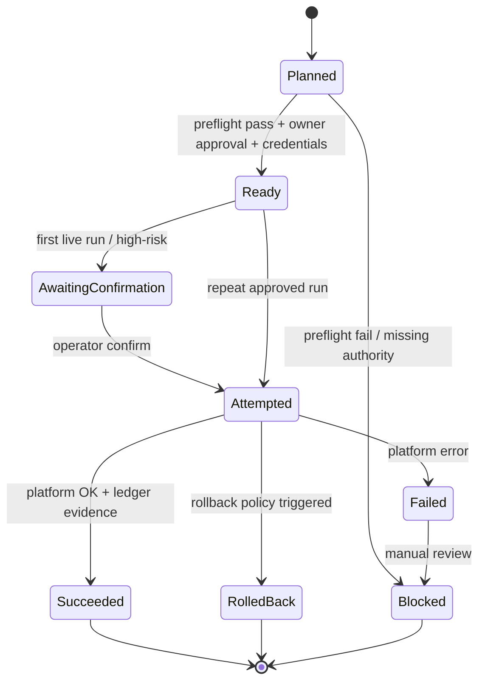
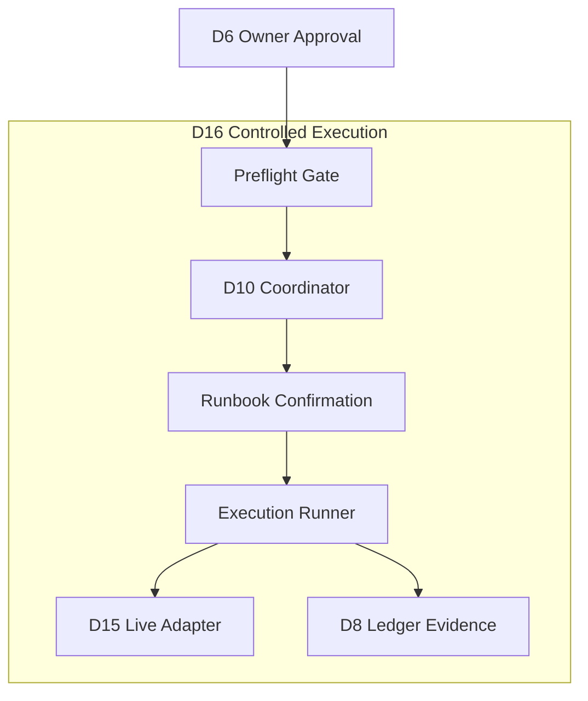
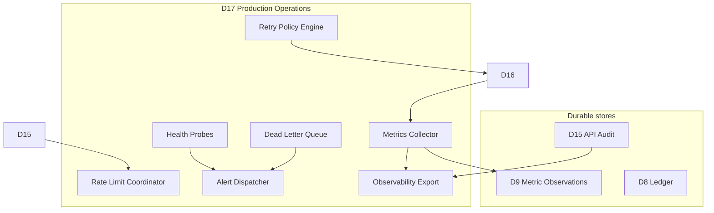
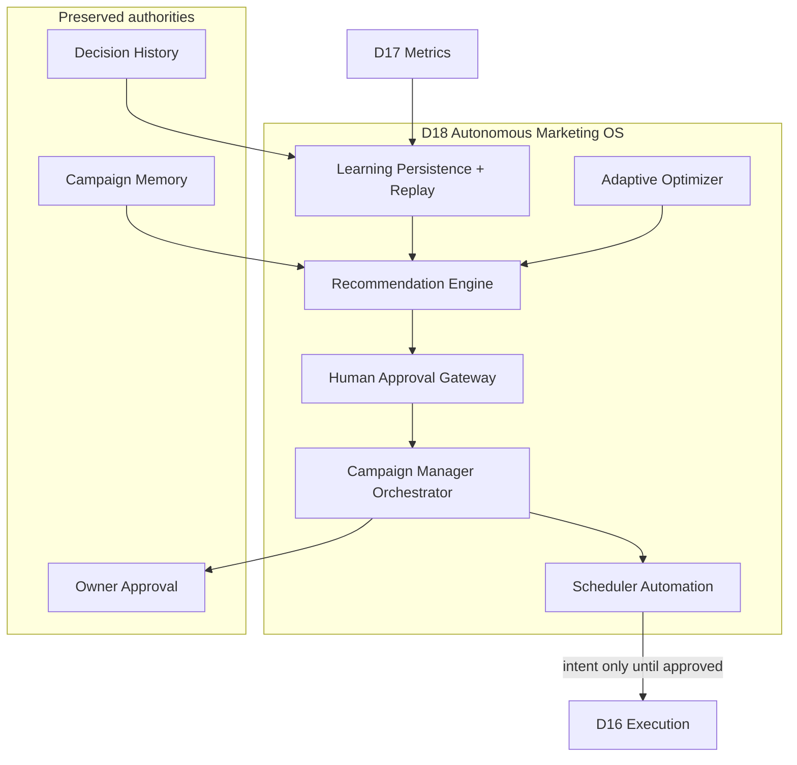
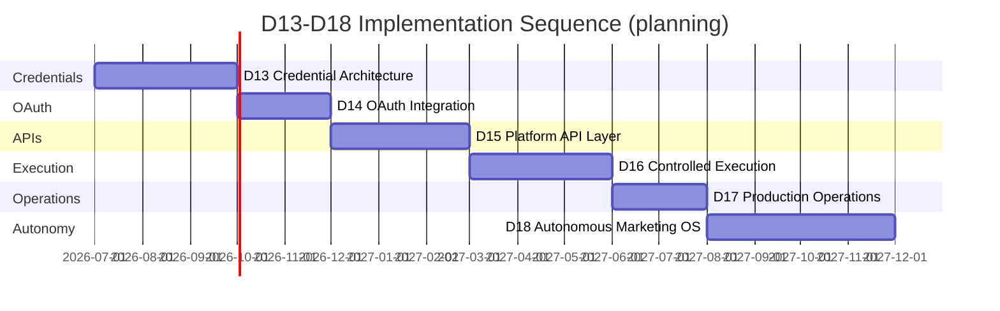

# D13–D18 Execution Plan

Status: **planning only**. No OAuth, credentials, HTTP, SDKs, execution, workers, cron, queues, retries, or protected-system changes are authorized by this document.

Accepted architecture HEAD: `f3fad34` — D12 Wave 4 OAuth admin diagnostics.

This document is the canonical technical execution plan for the remaining Jumping Jax AI Marketing Operating System milestones. It extends the frozen D1–D12 stack without modifying its behavior. Read alongside:

- `docs/ARCHITECTURE.md` — architectural constitution
- `docs/ROADMAP.md` — milestone ordering and status
- `docs/AI_AGENTS.md` — agent responsibilities and boundaries
- `docs/D12_INTEGRATION_GATE.md` — approval criteria that D13+ must satisfy before live integration

## Frozen Foundation (D1–D12)

The following stack is **complete and frozen**. D13–D18 may extend downward references and add new layers above; they must not mutate lower-layer semantics or protected systems (rentals, facility parties, booking, Google Calendar, inventory, driver app, customer-facing website).

```text
Decision History (D4.1)
↓ Promotion Engine (D4.3)
↓ Campaign Memory (D4.2)
↓ Working Context (D5)
↓ Publication Layer — owner approval, manifest, readiness (D6)
↓ Publication Targets (D7)
↓ Publication Ledger (D8 + H1–H6)
↓ Publication Scheduler — intent only (D9 M1–M3 + H9–H14)
↓ Publisher — read integration (D9 M4–M6 + H15–H20)
↓ Metrics — passive durable read (D9 M7–M9 + H21–H24)
↓ Learning — passive read layer (D9 M10–M12 + H25–H27)
↓ AI Operations Console (D9 Wave 11)
↓ Execution boundary — modeled, not running (D10 Waves 1–8)
↓ Platform adapter architecture — contract shells (D11 Waves 1–4)
↓ Secretless OAuth modeling + admin diagnostics (D12 Waves 1–4)
```

**Non-negotiable invariants carried forward:**

- Decision History is immutable; Campaign Memory is derived and rebuildable.
- Owner approval remains above automation; no publish authority without explicit approval chain.
- Reference-only persistence below execution; no platform payloads in ledger/scheduler/publisher rows.
- Replay is computed-only and non-authoritative until D16 explicitly defines execution authority.
- Admin diagnostics remain read-only until a separate execution-control approval gate passes.
- Fail-closed: missing authority, credentials, preflight failure, or ambiguous state blocks execution.

## Milestone Overview

| Milestone | Theme | Live network? | Live publish? |
|-----------|-------|---------------|---------------|
| D13 | Credential architecture | No | No |
| D14 | OAuth integration | Yes (OAuth only) | No |
| D15 | Platform API layer (adapters) | Yes (read/write APIs) | No (dry-run default) |
| D16 | Controlled execution | Yes | Yes (owner-gated) |
| D17 | Production operations | Yes | Yes |
| D18 | Autonomous Marketing OS | Yes | Yes (human approval) |

Each milestone is a **separate approval gate**. Completing D13 does not authorize D14. Each wave within a milestone requires build verification, explicit-path commits, and admin diagnostic review before the next wave begins.

---

## D13 — Credential Architecture

### Purpose

Establish encrypted, auditable, service-role-bounded storage for platform credentials **without** implementing OAuth flows, HTTP clients, or execution. D13 answers: where secrets live, how they are encrypted and rotated, how provider accounts map to publication targets, and how every credential action leaves an append-only audit trail — while preserving the D11 credential boundary contract (`social-platform-credential-boundary.ts`) as the vocabulary layer.

### Dependencies

| Dependency | Requirement |
|------------|-------------|
| D11 M7 | Credential boundary contract — provider/kind/state vocabulary |
| D11 M9 | Credential boundary replay — readiness projections |
| D11 M16–M17 | Platform readiness gate — blocked-state diagnostics |
| D12 integration gate | Credential storage approval criteria satisfied in design |
| D7 Publication Targets | Internal target identity for account linkage |
| Supabase service role | Vault writes isolated from anon/authenticated clients |

### Architecture Diagram



### Objects

| Object | Description |
|--------|-------------|
| `CredentialVaultRecord` | Encrypted blob reference + metadata (provider, kind, account_ref_id, key_version, created_at). Never stores plaintext in SQL. |
| `ProviderAccount` | Maps internal `publication_target_id` to external account identifier (page id, business account id) — reference ids only in durable rows. |
| `CredentialReference` | Opaque `credential_ref_id` consumed by D11 boundary; redacted hint for admin (e.g. `meta:page:***1234`). |
| `TokenLifecycleState` | Extends D11 `authorization_state` with durable timestamps: `issued_at`, `expires_at`, `last_rotated_at`, `revoked_at`. |
| `CredentialAuditEvent` | Append-only: actor, action (create/rotate/revoke/read_attempt), credential_ref_id, outcome, sanitized reason. |
| `EncryptionKeyVersion` | Active/retired key ids for envelope encryption and re-encryption jobs. |
| `ServiceRoleBoundary` | Explicit allowlist: only vault service module may decrypt; all other layers receive refs only. |

### Layer Placement

- **New Layer 16** (above D12 OAuth modeling, below D14 OAuth integration).
- Module namespace: `src/lib/social-posts/credentials/` (planned).
- Admin surface: `/admin/social-posts/credentials` (read-only; no connect/rotate buttons until D14).
- Does **not** modify Execution, Publisher, Scheduler, or Ledger behavior.

### Security Model

- **Encryption at rest:** AES-256-GCM envelope encryption; data key per record, master key from environment (Vercel env + rotation procedure documented).
- **Service-role boundary:** Supabase RLS denies all credential tables to `authenticated` and `anon`; only server-side vault module uses service role.
- **Redaction:** Logs, errors, tests, and admin UI never contain tokens, refresh tokens, app secrets, or authorization codes.
- **Least privilege:** Credential kinds map to minimum scopes needed per provider (inventory in D14).
- **Local dev:** Reference-mode vault with deterministic fake refs; production tokens forbidden in `.env.local` commits.
- **Incident response:** Documented revoke-all, key rotation, and audit export procedure before Wave 1 ships.

### Database Requirements

| Table | Shape | Notes |
|-------|-------|-------|
| `social_credential_vault_records` | id, provider, kind, account_ref_id, target_id (FK ref), encrypted_payload, key_version, created_at | Append-only create; rotate = new row + supersede flag |
| `social_provider_accounts` | id, provider, external_account_id, publication_target_id, display_name_redacted, status | Links D7 targets to external identity |
| `social_credential_audit_events` | id, credential_ref_id, actor_admin_id, action, outcome, sanitized_detail, created_at | Immutable trigger |
| `social_credential_key_versions` | version, status, activated_at, retired_at | Key rotation metadata |

**Migration rules:** Idempotent migrations; no destructive drops; backward compatible with D11 reference-only contracts.

### Replay Model

- **Input:** Provider accounts, vault record metadata (no decryption), lifecycle states, D11 boundary flags.
- **Output:** `authorized_reference` / `expired_reference` / `revoked_reference` / `scope_insufficient` / `not_authorized` buckets per target and provider.
- **Computed-only:** Replay grants no credential access; it explains readiness for admin and D11 readiness gate composition.
- **Determinism:** Same persisted rows → same replay buckets; timestamps affect `expired` only via explicit rules.

### Testing Strategy

- Unit: envelope encrypt/decrypt round-trip, forbidden plaintext detection, redaction validators.
- Unit: lifecycle state machine transitions (issue → expire → revoke).
- Replay: deterministic buckets from fixture metadata rows.
- Security: secret scanning fixtures rejected; admin render tests assert no token patterns.
- Integration: vault service with test master key only; no production Supabase in CI decrypt tests.
- Build: `npm run build` after each wave.

### Admin Diagnostics

- Provider account list with redacted external ids and link to publication target.
- Credential state per account: kind, authorization state, expiry window (not token value).
- Missing credential, expired, revoked, scope-insufficient buckets.
- Key version and last rotation timestamp.
- Audit trail summary (last 20 events, sanitized).
- Explicit banner: **diagnostic only; no connect or rotate controls in D13**.

### Rollback Strategy

- **Disable vault writes:** Feature flag `CREDENTIAL_VAULT_ENABLED=false` — reads fail closed.
- **Revoke all:** Mark all vault records `revoked` via audit-gated admin script (not UI button in D13).
- **Key compromise:** Rotate master key, re-encrypt records in background job (planned Wave 3); old key version retained read-only for decrypt until migration completes.
- **Schema rollback:** Migrations additive only; rollback = disable feature flag, not drop tables.

### Failure Modes

| Failure | Behavior |
|---------|----------|
| Master key missing/misconfigured | Vault fail-closed; replay shows `not_authorized` |
| Decrypt failure | Audit event; no partial exposure; execution blocked downstream |
| Duplicate account registration | Reject with deterministic error; no overwrite |
| Target id mismatch | Scope consistency trigger rejects write |
| Audit write failure | Fail-closed on credential mutation (no silent credential change) |

### Validation Checklist

- [ ] D12 credential storage approval criteria addressed in design review
- [ ] No plaintext secrets in SQL, logs, or admin HTML
- [ ] RLS denies non-service-role access to credential tables
- [ ] D11 boundary contract unchanged; new states are extensions only
- [ ] Publication targets linkage documented and tested
- [ ] Reference-mode works without Supabase vault
- [ ] `npm run build` passes
- [ ] No protected-system files modified
- [ ] Recovery vault and unrelated WIP excluded from commit

### Estimated Implementation Waves

| Wave | Deliverable |
|------|-------------|
| D13 W1 | Domain + vault interface contract + forbidden-state detection (no SQL) |
| D13 W2 | SQL schema + row mapping + envelope encryption service |
| D13 W3 | Production store + bridge + reference-mode fake vault |
| D13 W4 | Credential replay + readiness gate composition update |
| D13 W5 | Read-only admin diagnostics + navigation wiring |
| D13 W6 | Audit export, key rotation docs, security test harness |

### Risk Assessment

| Risk | Likelihood | Impact | Mitigation |
|------|------------|--------|------------|
| Master key exposure | Low | Critical | Env separation, rotation runbook, no key in repo |
| Plaintext leak in migration | Medium | Critical | Code review gate, secret scanners, CI fixtures |
| Scope creep into OAuth | Medium | High | Milestone gate; D13 PR checklist forbids HTTP |
| Target/account mismatch | Medium | Medium | FK consistency triggers, replay diagnostics |

---

## D14 — OAuth Integration

### Purpose

Implement real OAuth 2.0 connect and callback flows for Meta, TikTok, and LinkedIn that **populate D13 vault records** without enabling publish or general platform API execution. D14 delivers authorization code exchange, refresh token storage, state/PKCE validation, and session correlation — upgrading D12 secretless models into live flows with strict fail-closed behavior.

### Dependencies

| Dependency | Requirement |
|------------|-------------|
| D13 | Credential vault operational; provider accounts registered |
| D12 M1–M3 | OAuth request/callback/session replay vocabulary |
| D11 M8 | OAuth boundary contract |
| D12 integration gate | OAuth approval criteria satisfied |
| Admin auth | Existing admin session gates connect initiation |

### Architecture Diagram



### Objects

| Object | Description |
|--------|-------------|
| `OAuthAuthorizationIntent` | Extends D12 request model with live `state_ref_id`, PKCE verifier ref, redirect URI id, scope set. |
| `OAuthCallbackResult` | Live callback handler output; maps to D12 callback outcome vocabulary. |
| `OAuthTokenBundle` | Transient in-memory only during exchange; immediately encrypted into vault. |
| `OAuthSession` | Correlates intent + callback + vault credential_ref_ids. |
| `OAuthConnectApproval` | Human approval record: actor, provider, account, scopes, expiry review date. |

### Layer Placement

- **Layer 16b** — OAuth service sits above D13 vault, below D15 API layer.
- API routes (new): `/api/admin/social-oauth/connect`, `/api/admin/social-oauth/callback` — admin-gated only.
- Upgrades D12 models from "modeled" to "live" phases incrementally per wave.

### Security Model

- **CSRF:** Cryptographic state parameter; single-use; short TTL (10 min).
- **PKCE:** Required for all providers that support it; verifier stored server-side only.
- **Redirect URI allowlist:** Per-environment registered URIs; no open redirects.
- **Token handling:** Authorization code never logged; access/refresh tokens only in vault ciphertext.
- **Scope least privilege:** Provider-specific scope inventory documented per wave.
- **Human approval:** First connect per provider/account requires owner approval record.

### Database Requirements

| Table | Notes |
|-------|-------|
| `social_oauth_authorization_intents` | Append-only; state_ref_id, provider, scopes, pkce_ref, expires_at |
| `social_oauth_callback_events` | Append-only; outcome, error_code_redacted, intent_id |
| `social_oauth_sessions` | Correlates intent + callback + vault credential_ref_ids |
| `social_oauth_connect_approvals` | Human approval audit |

Reuse D13 vault tables for token storage; no duplicate token columns elsewhere.

### Replay Model

- Compose D12 session replay with live session rows + vault metadata (not decrypted tokens).
- Lifecycle states: `awaiting_callback`, `success`, `denied`, `canceled`, `provider_error`, `state_mismatch`, `expired`, `duplicate`.
- Admin shows session timeline with reference ids only.

### Testing Strategy

- Unit: state validation, PKCE verification, scope parsing, forbidden URL detection.
- Contract: mocked provider token responses (MSW or fixture files); **no live network in CI**.
- Integration: full connect/callback against provider sandbox in manual staging only.
- Replay: deterministic session summaries from fixture intents + callbacks.
- Security: authorization code and token patterns rejected from logs/tests.

### Admin Diagnostics

- Connect status per provider/account on `/admin/social-posts/credentials` and execution page OAuth section.
- Active sessions, awaiting callback, failed connects with sanitized errors.
- Scope sufficiency vs publication target requirements.
- Approval status and review-by date.
- **Connect button** introduced in D14 (POST) — first human-approved mutation surface since owner approval.

### Rollback Strategy

- Global: `OAUTH_ENABLED=false` — callbacks return safe error page; no token exchange.
- Per provider: disable provider in registry config.
- Per account: revoke vault credentials + mark session `revoked`.
- Callback route remains up to accept provider redirects but discards tokens when disabled.

### Failure Modes

| Failure | Behavior |
|---------|----------|
| State mismatch | Reject; audit; no token exchange |
| Denied scopes | Vault not written; replay `scope_insufficient` |
| Provider outage | Fail-closed; retry connect later (manual) |
| Duplicate callback | Idempotent session handling; no double vault write |
| Token exchange error | Sanitized admin diagnostic; audit event |

### Validation Checklist

- [ ] D12 OAuth approval criteria checklist complete
- [ ] PKCE + state validated on every callback
- [ ] No tokens in SQL plaintext, logs, or client bundles
- [ ] Redirect URI allowlist enforced per environment
- [ ] Owner approval recorded for first connect
- [ ] D12 replay diagnostics updated for live sessions
- [ ] CI has zero live OAuth network calls
- [ ] `npm run build` passes

### Estimated Implementation Waves

| Wave | Deliverable |
|------|-------------|
| D14 W1 | OAuth service domain + state/PKCE + forbidden-state checks |
| D14 W2 | Connect route + redirect (Meta first) |
| D14 W3 | Callback route + token exchange + vault write |
| D14 W4 | Session persistence + D12 replay upgrade |
| D14 W5 | TikTok + LinkedIn provider modules |
| D14 W6 | Admin connect UX + approval flow + diagnostics |
| D14 W7 | Refresh token rotation job (no publish) |

### Risk Assessment

| Risk | Likelihood | Impact | Mitigation |
|------|------------|--------|------------|
| OAuth redirect hijack | Low | Critical | State/PKCE, URI allowlist |
| Overbroad scopes | Medium | High | Scope inventory + owner approval |
| Token logged in error | Medium | Critical | Redaction middleware, CI secret scan |
| Partial provider outage | Medium | Medium | Per-provider flags, fail-closed |

---

## D15 — Platform API Layer

### Purpose

Replace D11 dry-run adapter contract shells with **real HTTP/SDK adapters** for Meta, TikTok, and LinkedIn — capable of validated API calls (profile read, media upload dry-run, publish **simulation**) while defaulting to dry-run mode. D15 does not run the execution coordinator or publish customer-facing posts; it provides the adapter implementations that D16 will invoke.

### Dependencies

| Dependency | Requirement |
|------------|-------------|
| D13–D14 | Valid credentials and OAuth sessions per account |
| D11 M4–M15 | Adapter contracts, registry, factory, dry-run shells |
| D10 M8–M10 | Execution adapter contract layer |
| D12 integration gate | HTTP/API client approval criteria |
| D16 (design) | Idempotency key format agreed before live publish endpoints enabled |

### Architecture Diagram



### Objects

| Object | Description |
|--------|-------------|
| `PlatformHttpClient` | Timeout, retry policy (documented, not auto-retry publish), rate-limit headers. |
| `MetaGraphAdapter` | Implements `social-platform-meta-adapter` contract with real Graph API. |
| `TikTokBusinessAdapter` | Implements TikTok contract shell. |
| `LinkedInMarketingAdapter` | Implements LinkedIn contract shell. |
| `AdapterRequestContext` | credential_ref_id, idempotency_key, dry_run flag, correlation_id. |
| `NormalizedPlatformError` | Taxonomy: rate_limit, auth_expired, validation, provider_outage, unknown. |
| `AdapterCapabilityProbe` | Read-only probe: token valid, scopes sufficient, account reachable. |

### Layer Placement

- **Layer 17** — Platform API adapters.
- Module namespace: `src/lib/social-posts/platform-adapters/live/`.
- Factory selects `dry-run` vs `live` based on env flag + owner approval record.
- No changes to Scheduler/Publisher execution paths.

### Security Model

- Credentials fetched only inside adapter boundary via vault service; never passed to admin or replay.
- Request logging records endpoint, status, correlation_id — not request bodies with tokens.
- Rate limits enforced per provider; global circuit breaker when error threshold exceeded.
- Live mode requires `PLATFORM_ADAPTER_LIVE_ENABLED` + per-provider approval flag.
- Default CI and preview: dry-run only.

### Database Requirements

| Table | Notes |
|-------|-------|
| `social_platform_api_call_audit` | Append-only: adapter, endpoint_class, status, correlation_id, idempotency_key, dry_run flag |
| `social_platform_adapter_approvals` | Owner approval for promoting dry-run → live per provider |

No platform response payloads stored; sanitized error codes only.

### Replay Model

- Extend D11 per-platform adapter replay with `live_probe_result` from audit metadata.
- Buckets: `adapter_ready`, `adapter_blocked_auth`, `adapter_blocked_capability`, `adapter_blocked_rate_limit`, `dry_run_only`.
- Composition with D11 readiness gate unchanged in authority (non-authoritative).

### Testing Strategy

- Contract tests: recorded fixtures per provider endpoint (vcr-style, committed JSON).
- Unit: error normalization, idempotency key generation, forbidden live flag in test env.
- Adapter tests: mock HTTP only in CI.
- Manual staging: live probe against sandbox accounts.
- Replay determinism tests from audit fixture rows.

### Admin Diagnostics

- Per-platform: live vs dry-run mode, last probe result, rate-limit headroom.
- Capability matrix vs target channel requirements.
- Recent API call audit summary (counts by status, no payloads).
- Explicit **no publish button** on this layer.

### Rollback Strategy

- `PLATFORM_ADAPTER_LIVE_ENABLED=false` — factory returns dry-run adapters only.
- Per-provider circuit breaker flag.
- Revoke OAuth (D14) cascades to `adapter_blocked_auth` in replay.

### Failure Modes

| Failure | Behavior |
|---------|----------|
| Auth expired | Normalized `auth_expired`; admin prompts reauthorize (D14) |
| Rate limited | Backoff; no publish queue yet |
| Invalid media ref | Validation error before HTTP in dry-run |
| Provider 5xx | Circuit breaker; audit; fail-closed for D16 |

### Validation Checklist

- [ ] HTTP client approval criteria from D12 gate satisfied
- [ ] No live network calls in default CI
- [ ] Idempotency key format documented
- [ ] Error taxonomy matches execution coordinator expectations
- [ ] Vault-only credential access verified
- [ ] Dry-run remains default in preview
- [ ] `npm run build` passes

### Estimated Implementation Waves

| Wave | Deliverable |
|------|-------------|
| D15 W1 | HTTP client boundary + audit logging |
| D15 W2 | Meta live adapter — probe + media validate (no publish) |
| D15 W3 | Meta publish call behind `dry_run=true` default |
| D15 W4 | TikTok live adapter |
| D15 W5 | LinkedIn live adapter |
| D15 W6 | Factory live/dry-run selection + approval gates |
| D15 W7 | Rate limit + circuit breaker + admin diagnostics |

### Risk Assessment

| Risk | Likelihood | Impact | Mitigation |
|------|------------|--------|------------|
| Accidental live publish in test | Medium | Critical | dry_run default, CI guards, no publish in D15 W2–W3 |
| Provider API drift | High | Medium | Contract fixtures, versioned adapter modules |
| Rate limit during probe | Medium | Low | Probe scheduling, cached probe results |

---

## D16 — Controlled Execution

### Purpose

Activate the D10 execution coordinator pipeline for **owner-approved, preflight-passed, idempotent publish attempts** — the first customer-facing platform actions. D16 introduces the execution runner, publishing pipeline, human confirmation gates, ledger evidence writes, and rollback hooks while keeping automation bounded and fail-closed.

### Dependencies

| Dependency | Requirement |
|------------|-------------|
| D10 M1–M14 | Execution domain, coordinator, preflight, planner, runbook |
| D11–D15 | Platform adapters with live capability |
| D6–D8 | Owner approval, manifest, ledger |
| D9 | Scheduler intent, Publisher records |
| D12 gate | Execution runner approval criteria |

### Architecture Diagram





### Objects

| Object | Description |
|--------|-------------|
| `ExecutionRunner` | Sole module authorized to invoke live adapters. |
| `ExecutionAttempt` | Durable row linking execution intent, idempotency_key, adapter correlation_id. |
| `PublishPipeline` | Ordered: resolve target → load credentials → adapter preflight → publish → capture result → ledger append. |
| `OwnerExecutionApproval` | Extends owner approval with execute-specific scope and expiry. |
| `RollbackDirective` | Platform-specific takedown/delete attempt or `rollback_unavailable` evidence. |
| `IdempotencyRecord` | Prevents duplicate publish for same manifest + target + content hash. |

### Layer Placement

- **Layer 18** — Controlled execution runner above D15 adapters.
- Activates dormant D8 scheduler boundary adapter only for evidence validation, not auto-schedule.
- API route: `/api/admin/social-execution/run` — POST, heavily gated.

### Security Model

- Runner checks full authority chain: owner approval → manifest readiness → target → ledger precondition → publisher request ref → credentials → preflight → runbook confirmation.
- First live publish per post/target requires explicit operator confirmation (runbook M11).
- Idempotency enforced at runner and adapter layers.
- All attempts append ledger evidence before returning success to admin.
- No cron/workers in D16 Wave 1 — manual trigger only.

### Database Requirements

- Reuse `social_publication_execution_*` tables (D10 H28).
- New: `social_execution_idempotency_keys`, `social_execution_operator_confirmations`.
- Ledger outcomes extended with `platform_post_ref` sanitized external id only.

### Replay Model

- D10 execution replay becomes **authoritative for attempted jobs** when `attempted_at` present.
- Coordinator replay + live attempt status composed for admin.
- Pipeline trace in Operations Console gains execution attempt stage.

### Testing Strategy

- State machine unit tests for all transitions.
- Integration: end-to-end with dry-run adapter in CI.
- Staging: single manual live publish with owner sign-off.
- Idempotency: duplicate run returns same outcome, no double publish.
- Ledger: every attempt produces evidence row.

### Admin Diagnostics

- Execution page gains **Run** control (POST) only after runbook checklist complete.
- Preflight + coordinator + adapter + credential status on one screen.
- Attempt history with platform post ref (redacted), rollback status.
- Operations Console pipeline trace includes execution attempts.

### Rollback Strategy

- **Pre-attempt:** Cancel from `Ready` — no platform call.
- **Post-success:** Platform-specific delete/hide where supported; else `rollback_unavailable` + owner alert.
- **Post-failure:** No automatic retry in D16 W1; manual retry with new idempotency key.
- **Global kill switch:** `EXECUTION_RUNNER_ENABLED=false`.

### Failure Modes

| Failure | Behavior |
|---------|----------|
| Missing owner approval | Blocked; no API call |
| Credential expired mid-run | Fail; audit; prompt reauth |
| Partial publish (media OK, post fail) | Failed + sanitized evidence; manual review |
| Duplicate idempotency key | Return prior result; no second publish |
| Ledger write failure | Fail-closed; treat as failed attempt even if platform succeeded |

### Validation Checklist

- [ ] D12 execution runner approval criteria complete
- [ ] Full authority chain verified in code review
- [ ] Idempotency tested
- [ ] Ledger evidence on every attempt
- [ ] Runbook confirmation required for first live run
- [ ] Kill switch tested
- [ ] No scheduler/cron auto-execution
- [ ] Protected systems untouched
- [ ] `npm run build` passes

### Estimated Implementation Waves

| Wave | Deliverable |
|------|-------------|
| D16 W1 | Runner domain + state machine (no HTTP) |
| D16 W2 | Manual run POST + dry-run path end-to-end |
| D16 W3 | Live publish single-channel (Meta FB) |
| D16 W4 | Ledger evidence + platform post ref capture |
| D16 W5 | Instagram + TikTok + LinkedIn channels |
| D16 W6 | Rollback directives + operator confirmation UX |
| D16 W7 | Operations Console execution stage integration |

### Risk Assessment

| Risk | Likelihood | Impact | Mitigation |
|------|------------|--------|------------|
| Duplicate publish | Medium | Critical | Idempotency + ledger checks |
| Publish without approval | Low | Critical | Authority chain, code review, kill switch |
| Ledger/platform mismatch | Low | High | Fail-closed if ledger write fails |
| Irreversible publish | High | Medium | Runbook warnings, owner confirmation |

---

## D17 — Production Operations

### Purpose

Make the marketing platform **operable in production**: metrics collection from real platforms, retry policies, rate-limit management, health checks, alerts, dead-letter handling, and observability — without enabling autonomous scheduling or learning-driven automation.

### Dependencies

| Dependency | Requirement |
|------------|-------------|
| D16 | Successful publish attempts producing platform post refs |
| D9 Metrics | Passive metrics durable store (H21–H24) |
| D15 | Platform adapters for metrics endpoints |
| D9 Operations Console | Diagnostic composition patterns |

### Architecture Diagram



### Objects

| Object | Description |
|--------|-------------|
| `MetricsCollectorJob` | Polls platform insights for published post refs; appends D9 observations. |
| `RetryPolicy` | Classifies errors: no-retry, retry-with-backoff, requires-human. |
| `RateLimitBudget` | Per-provider token bucket from API response headers. |
| `HealthProbe` | Credential validity, adapter reachability, queue depth. |
| `DeadLetterRecord` | Failed operations exceeding retry max; requires operator review. |
| `AlertEvent` | Email/webhook to owner for critical failures (configurable). |

### Layer Placement

- **Layer 19** — Operations infrastructure.
- Background jobs introduced here (Vercel cron or approved worker) — first cron in marketing platform.
- Does not mutate Learning or Campaign Memory automatically.

### Security Model

- Collector uses service role + vault; read-only platform metrics scopes where possible.
- Alerts never include tokens or full error payloads.
- Dead-letter admin requires admin auth; no public endpoints.
- Retry engine cannot bypass owner approval or idempotency.

### Database Requirements

| Table | Notes |
|-------|-------|
| `social_operations_health_snapshots` | Append-only probe results |
| `social_operations_dead_letters` | Failed job metadata + correlation ids |
| `social_operations_alert_events` | Alert audit trail |

Extend D9 metrics observations with `collected_at`, `collector_version`, `platform_metric_ref`.

### Replay Model

- Operations Console new section: health, retry queue depth, dead-letter count, last collector run.
- Metrics replay gains `collected` vs `manual` observation source bucket.
- Non-authoritative; does not trigger publish.

### Testing Strategy

- Retry policy unit tests per error class.
- Collector tests with fixture API responses.
- Health probe fail-closed tests.
- Alert content redaction tests.
- Cron idempotency: same window does not double-collect.

### Admin Diagnostics

- `/admin/social-posts/operations` extended: health grid, collector status, rate limits, dead letters.
- `/admin/social-posts/publication-metrics` shows collection source and last sync.
- Alert history with sanitized messages.

### Rollback Strategy

- Disable collector cron independently of execution runner.
- Pause retries globally via `RETRY_ENGINE_ENABLED=false`.
- Dead-letter replay manual only; no auto-retry of dead letters without operator action.

### Failure Modes

| Failure | Behavior |
|---------|----------|
| Collector rate limited | Backoff; partial metrics; alert if sustained |
| Stale credentials | Health probe fails; block collector for account |
| Dead-letter growth | Alert owner; no auto-publish impact |
| Alert dispatch failure | Audit locally; retry alert send |

### Validation Checklist

- [ ] Metrics collection does not grant publish authority
- [ ] Retry policy cannot override idempotency
- [ ] Cron jobs documented in deployment runbook
- [ ] Alerts redacted
- [ ] Dead-letter review workflow documented
- [ ] `npm run build` passes

### Estimated Implementation Waves

| Wave | Deliverable |
|------|-------------|
| D17 W1 | Retry policy domain + error classification |
| D17 W2 | Rate limit coordinator |
| D17 W3 | Metrics collector (Meta insights) |
| D17 W4 | TikTok + LinkedIn collectors |
| D17 W5 | Health probes + cron |
| D17 W6 | Dead-letter queue + admin review |
| D17 W7 | Alerts + observability export |

### Risk Assessment

| Risk | Likelihood | Impact | Mitigation |
|------|------------|--------|------------|
| Runaway retries | Medium | High | Max retry caps, dead-letter |
| Cron duplicate work | Medium | Medium | Idempotent collector windows |
| Alert fatigue | High | Low | Severity thresholds, digest mode |

---

## D18 — Autonomous Marketing OS

### Purpose

Complete the vision: **campaign scheduling with learning feedback, recommendation engine, adaptive optimization, and human approval** — the Campaign Manager orchestration layer that proposes plans and improvements without hiding decisions. D18 closes the loop from Metrics → Learning → Promotion candidates → owner-approved strategy changes → Scheduler intent, while preserving explainability and owner authority.

### Dependencies

| Dependency | Requirement |
|------------|-------------|
| D17 | Reliable metrics and operations |
| D9 Learning | Passive learning foundation (upgrade to durable store) |
| D4 Promotion Engine | Manual promotion path remains for memory writes |
| D9 Scheduler | Intent storage (execution wiring optional per approval) |
| D16 | Proven controlled execution |
| D6 | Owner approval for all customer-facing actions |

### Architecture Diagram



### Objects

| Object | Description |
|--------|-------------|
| `CampaignManagerOrchestrator` | Delegates to agent roles; collects recommendations; never publishes directly. |
| `Recommendation` | Typed proposal: timing, channel, content adjustment, budget note — status `pending_approval`. |
| `LearningProductionStore` | Durable learning insights (upgrade from M11 in-memory only). |
| `AdaptiveOptimizer` | Rank experiments and cadence suggestions from metrics; no auto-apply. |
| `SchedulerAutomationPolicy` | Rules for proposing schedule intents; owner approves batch. |
| `HumanApprovalGateway` | Single entry for approving recommendations, schedules, and optimizations. |

### Layer Placement

- **Layer 20** — Campaign Manager / Autonomous OS.
- Learning production store finally implemented (D9 M11 upgrade).
- Scheduler automation proposes intents; does not execute without D16 + approval.

### Security Model

- No autonomous publish; no autonomous memory promotion.
- Recommendations are append-only until owner accepts or rejects (new decision history rows).
- Optimizer inputs are reference-only; no hidden state.
- AI model calls (if any) documented with prompt audit trail; no customer PII in prompts.

### Database Requirements

| Table | Notes |
|-------|-------|
| `social_publication_learning_insights` | Durable M10 insights |
| `social_campaign_recommendations` | Pending/approved/rejected proposals |
| `social_scheduler_automation_proposals` | Batch schedule intents awaiting approval |
| `social_optimizer_experiments` | A/B style experiment metadata |

### Replay Model

- Learning replay uses production store; Operations Console Learning row no longer `production_unavailable`.
- Recommendation buckets: `pending`, `approved`, `rejected`, `stale`.
- Campaign Manager dashboard: pipeline from metrics → insight → recommendation → approval → schedule intent.

### Testing Strategy

- Promotion path still manual; tests verify no auto-promote.
- Recommendation → approval → scheduler intent integration tests.
- Optimizer rank determinism from fixture metrics.
- Learning persistence round-trip and replay determinism.

### Admin Diagnostics

- New `/admin/social-posts/campaign-manager` (or extend operations): recommendations queue, optimizer suggestions, scheduler proposals.
- Every recommendation shows evidence ids, confidence, and plain-language rationale.
- Owner approve/reject controls with audit trail.

### Rollback Strategy

- Disable automation: `CAMPAIGN_MANAGER_AUTOMATION_ENABLED=false` — recommendations still generated, not scheduled.
- Reject recommendation batch — no scheduler writes.
- Retract promoted memory via existing Promotion Engine retraction (D4).

### Failure Modes

| Failure | Behavior |
|---------|----------|
| Low-confidence recommendation | Blocked bucket; not shown for approval |
| Metrics gap | Optimizer degrades; does not propose timing changes |
| Approval timeout | Recommendations expire; remain audit-visible |
| Scheduler proposal without approval | Fail-closed; no intent write |

### Validation Checklist

- [ ] No autonomous publish or memory promotion
- [ ] Every recommendation traceable to metrics/decision ids
- [ ] Owner approval on all customer-facing proposals
- [ ] Learning production store replay deterministic
- [ ] Scheduler proposals remain intent-only until execution approved
- [ ] AI agent doc updated with Campaign Manager status
- [ ] `npm run build` passes

### Estimated Implementation Waves

| Wave | Deliverable |
|------|-------------|
| D18 W1 | Learning production store (SQL + bridge upgrade) |
| D18 W2 | Recommendation engine domain + replay |
| D18 W3 | Campaign Manager orchestrator (read-only delegations) |
| D18 W4 | Human approval gateway for recommendations |
| D18 W5 | Scheduler automation proposals |
| D18 W6 | Adaptive optimizer (rank-only) |
| D18 W7 | Campaign Manager admin + Operations Console integration |
| D18 W8 | End-to-end approval → schedule intent → manual execution path |

### Risk Assessment

| Risk | Likelihood | Impact | Mitigation |
|------|------------|--------|------------|
| Hidden automation | Medium | Critical | Approval gateway, no auto-publish |
| Bad learning persistence | Medium | High | Evidence requirements, manual promotion |
| Over-automation of schedule | Medium | High | Batch approval, intent-only default |
| AI hallucination in recommendations | High | Medium | Evidence linkage, confidence thresholds |

---

## Cross-Milestone Sequencing



**Hard gates between milestones:**

1. D13 complete + security review → D14 authorized.
2. D14 complete + OAuth staging sign-off → D15 authorized.
3. D15 complete + dry-run live probes pass → D16 authorized.
4. D16 complete + first live publish runbook signed → D17 authorized.
5. D17 complete + 30-day operations stability → D18 authorized.

## Global Testing and Validation (All Phases)

- `npm run build` must pass after every wave.
- Focused eslint on changed files only.
- No `git add .` — explicit-path staging per commit safety gate.
- CI network guard: block live provider calls except approved integration job.
- Replay determinism regression suite grows with each milestone.
- Admin pages remain auth-gated; new POST controls documented per milestone.

## Protected Systems Boundary

D13–D18 work is confined to:

- `src/lib/social-posts/**`
- `src/app/admin/social-posts/**`
- `src/app/api/admin/social-*` (new routes only)
- `supabase/migrations/*social*` (new migrations only)

**Explicitly forbidden without separate approval:**

- Rentals, facility parties, booking, Google Calendar, inventory, driver app, customer-facing routes.

## Document Maintenance

When a milestone wave ships, update:

1. `docs/ROADMAP.md` — status line only; link here for detail.
2. `docs/ARCHITECTURE.md` — new layer entry when implemented.
3. `docs/AI_AGENTS.md` — agent status when orchestration goes live.

This document remains the planning reference until D18 complete; then archive as `docs/D13_D18_COMPLETION_REPORT.md` and fold summary into ROADMAP.

---

*Planning document. No implementation authorized. D13 work must not begin until this plan is reviewed and accepted.*
