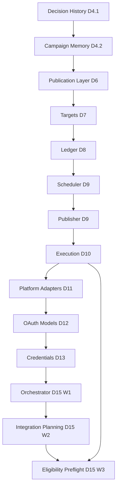

# D15 Architecture Baseline

**Version:** D15-Baseline-1.0  
**Accepted HEAD:** `6b41ab7` — D15 Wave 3 Complete (Production Verified)  
**Audit date:** 2026-07-04  
**Scope:** Read-only architecture freeze for D1–D15. No runtime behavior changes.

This document is the authoritative architecture reference for the Jumping Jax AI Marketing Platform at the D15 milestone. It supersedes informal summaries in commit messages and should be read alongside:

- `docs/ARCHITECTURE.md` — constitutional layer definitions
- `docs/ROADMAP.md` — milestone ordering and completion status
- `docs/AI_AGENTS.md` — agent role boundaries
- `docs/D12_INTEGRATION_GATE.md` — approval gate before live OAuth/HTTP/execution
- `docs/D13_D18_EXECUTION_PLAN.md` — technical plan for D16–D18 (not authorized)

---

## 1. Platform Purpose

The AI Marketing Platform is an explainable, auditable marketing system that plans, generates, evaluates, and prepares social content while keeping the business owner as the final approval authority. Through D15, every publication, execution, credential, and OAuth surface is **modeled, persisted where applicable, replayed, and inspected** — but **nothing publishes, schedules, executes, or contacts social platforms**.

---

## 2. Completed Milestones (D1–D15)

| Milestone | Theme | Status | Authority granted |
|-----------|-------|--------|-------------------|
| **D1** | AI generation foundation | Complete | Creative generation only |
| **D2** | Persistent asset architecture | Complete | Asset persistence |
| **D3** | Async video pipeline | Complete | Video status tracking |
| **D4.1** | Decision history | Complete | Immutable decision records |
| **D4.2** | Campaign memory | Complete | Derived, versioned knowledge |
| **D4.3** | Manual promotion engine | Complete | Explicit promotion only |
| **D4.7** | Architecture constitution | Complete | Documentation |
| **D5** | Working context | Complete | Temporary, non-authoritative context |
| **D6** | Publication layer (approval, manifest, readiness) | Complete | Preparation only |
| **D7** | Publication targets | Complete | Target definitions |
| **D8** | Publication ledger + H1–H6 | Complete | Append-only evidence |
| **H1–H14** | Ledger/scheduler durability + admin read | Complete | Read visibility |
| **D9** | Scheduler, publisher, metrics, learning, operations console (Waves 1–11) | Complete | Intent/read models only |
| **D10** | Execution boundary (Waves 1–8) | Complete | Modeled pipeline; no runner |
| **D11** | Platform adapter architecture (Waves 1–4) | Complete | Contract shells + dry-run |
| **D12** | Secretless OAuth modeling (Waves 1–4) | Complete | Model/replay only |
| **D13** | Credential architecture (Waves 1–5) | Complete | Metadata persistence; no encryption execution |
| **D14** | OAuth integration | **Not started** (one admin diagnostics replay module exists; no live OAuth) |
| **D15** | Credential runtime orchestration (Waves 1–3) | Complete | Planning/preflight diagnostics only |

**D15 explicitly not started:** live Meta/TikTok/LinkedIn HTTP adapters, SDK integrations, rate limiting, circuit breakers, publishing, execution runners.

---

## 3. Layer Stack and Dependency Graph

```text
D1–D3  Creative Production (OpenAI, Replicate, video — outside publication boundary)
↓
D4.1   Decision History (immutable source of truth)
↓
D4.3   Promotion Engine (manual, deterministic)
↓
D4.2   Campaign Memory (derived, versioned, evidence-linked)
↓
D5     Working Context (temporary, rebuilt)
↓
D6     Publication Layer (owner approval, manifest, readiness)
↓
D7     Publication Targets
↓
D8+H   Publication Ledger (append-only)
↓
D9     Scheduler intent → Publisher records → Metrics observations → Learning insights (read)
↓
D9 W11 AI Operations Console (composition only)
↓
D10    Execution boundary (domain → store → bridge → preflight → planner → adapter → runbook → coordinator)
↓
D11    Platform adapter registry/factory + Meta/TikTok/LinkedIn contract shells + readiness gate
↓
D12    Secretless OAuth request/callback/session modeling
↓
D13    Credential vault architecture (domain → repository → store → bridge → encryption/crypto policy boundaries)
↓
D15 W1 Credential runtime orchestrator (composes D13 readiness + D11 capability)
↓
D15 W2 Provider integration planning + credential resolution execution bridge
↓
D15 W3 Publication execution eligibility preflight (composes D10 preflight + D15 orchestration)
```

**Dependency rules:**

- Upper layers may reference lower layers by **ID only** in durable rows.
- Replay modules may import domain/repository modules; domain modules must not import replay.
- Bridges select reference vs production stores; production mode fails closed when misconfigured.
- No layer below D16 grants publish or execution authority.



---

## 4. Architectural Boundaries

### 4.1 Repository boundaries

| Subsystem | Pattern | Mutability |
|-----------|---------|------------|
| Publication ledger/scheduler/publisher/metrics/execution | domain → rows → store → bridge | Append-only (SQL triggers) |
| Credential vault (D13) | domain → repository → store → bridge | Metadata mutable; audit events append-only |
| Learning | domain → in-memory repository → fail-closed bridge | No production store |
| Creative (D1–D3) | engines → API routes | Mutable `social_posts` / assets |

### 4.2 Orchestration boundaries (D15)

- **Orchestrator** (`social-credential-runtime-orchestrator.ts`): composes D13 readiness, encryption readiness, crypto policy, and D11 capability replay into per-provider orchestration plans. `grantsExecutionPermission: false`.
- **Integration planning** (`social-provider-integration-planning.ts`): connection/capability/authorization/communication boundary contracts. Live connection forbidden.
- **Resolution bridge** (`social-credential-resolution-execution-bridge.ts`): deterministic provider reference selection and repository lookup for planning only.
- **Eligibility preflight** (`social-publication-execution-eligibility-preflight.ts`): composes D10 execution preflight with credential/orchestration readiness.

All D15 surfaces are GET-only diagnostics on `/admin/social-posts/publication-execution`.

### 4.3 Replay boundaries

57+ `*-replay.ts` modules provide deterministic, computed-only projections. Admin pages consume replay output; replay never mutates state or grants authority.

### 4.4 Credential boundaries (D13)

- **Contract vocabulary:** D11 `social-platform-credential-boundary.ts`
- **Domain/repository:** `credentials/social-credential-domain.ts`, `social-credential-repository.ts`
- **Storage:** `social-credential-store.ts` + `20260704103000_create_social_credentials.sql`
- **Encryption:** contract-only boundary (`implementation_forbidden` for encrypt/decrypt/rotate)
- **Crypto policy:** D13 W5 domain/boundary/replay
- **Admin:** snapshot reads via credential bridge on publication-execution page

SQL constraints enforce `metadata_only`, `contains_plaintext = false`, `contains_ciphertext = false`, `contains_key_material = false`.

### 4.5 Execution boundaries (D10)

Execution store/bridge can persist intents/results (tests and manual writes only). No API route or admin POST triggers execution. All `grants_execution_permission` columns are `false`.

### 4.6 Diagnostics boundaries

Operations console and publication-execution admin are display-only. Diagnostics never repair, retry, or mutate reported conditions.

---

## 5. Runtime Composition

### 5.1 Production data stores

```text
social_posts / social_post_assets / social_post_decisions
social_campaign_memories / social_campaign_memory_evidence
social_owner_approval_* (D6)
social_publication_targets (D7)
social_publication_ledger_* (D8)
social_publication_schedule_intents (D9)
social_publication_publisher_* (D9)
social_publication_metric_* (D9)
social_publication_execution_* (D10)
social_credential_* (D13 — vault, lifecycle, audit, key versions)
```

Learning has **no** production SQL tables. Manifest and readiness are **computed views**.

### 5.2 Admin read surfaces (all auth-gated, GET-only for publication stack)

| Route | Milestones |
|-------|------------|
| `/admin/social-posts` | Hub |
| `/admin/social-posts/working-context` | D5 |
| `/admin/social-posts/memory` | D4 |
| `/admin/social-posts/publication-manifest` | D6, D7 |
| `/admin/social-posts/publication-ledger` | D8 |
| `/admin/social-posts/publication-scheduler` | D9 |
| `/admin/social-posts/publication-publisher` | D9 |
| `/admin/social-posts/publication-metrics` | D9 |
| `/admin/social-posts/publication-learning` | D9 |
| `/admin/social-posts/publication-execution` | D10–D15 diagnostics |
| `/admin/social-posts/operations` | D9 W11 |

### 5.3 API routes (creative only)

`src/app/api/social-posts/*` — drafts, image/video generation, director preview. **No** publication, scheduler, publisher, execution, credential, or OAuth routes.

### 5.4 Bridge pattern

Every durable subsystem uses environment-aware bridges:

1. Resolve reference vs production mode
2. Fail closed on misconfiguration
3. Reject unsafe reference mode in production
4. Expose list/load/snapshot reads
5. Write methods exist for tests; not wired to HTTP/admin POST

---

## 6. Replay Model

**Principles:**

1. Replay input is durable records or in-memory test fixtures — never live platform state.
2. Replay output is computed at read time and is **non-authoritative**.
3. Replay uses explicit sorting, validation-first pipelines, and version constants.
4. Replay modules classify records into buckets (pending, blocked, ready, failed, etc.).
5. Cross-layer replay composes lower replays without importing stores or bridges.

**D15 replay chain:**

```text
D13 readiness/encryption/crypto policy replay
→ D15 W1 orchestrator replay
→ D15 W2 integration planning replay + resolution bridge replay
→ D15 W3 eligibility preflight replay (also consumes D10 preflight replay)
```

---

## 7. Append-Only Guarantees

| Store | Enforcement |
|-------|-------------|
| Publication ledger | SQL triggers — no update/delete |
| Scheduler intents | SQL triggers |
| Publisher requests/results/evidence | SQL triggers |
| Metrics observations/evidence | SQL triggers |
| Execution intents/results/evidence | SQL triggers |
| Credential audit events | SQL triggers |
| Credential vault/lifecycle/provider accounts/key versions | **Not append-only** — update/delete permitted at store level; no admin mutation UI today |

**Invariant:** Publication evidence rows are never rewritten. Credential metadata may be updated for lifecycle management; audit trail for credential actions is append-only.

---

## 8. Deterministic Guarantees

**Deterministic (given fixed inputs):**

- All replay modules
- Promotion engine rules and thresholds
- Manifest/readiness computation
- D15 orchestration and eligibility preflight
- Forbidden-key / forbidden-state validators in domain and row mappers

**Non-deterministic (by design, outside publication boundary):**

- OpenAI creative director (`openai-creative-director.ts`)
- Replicate image generation (`image-provider.ts`)
- Video engine external calls (`video-engine.ts`)

---

## 9. Credential Architecture (D13)

| Wave | Module | Purpose |
|------|--------|---------|
| W1 | `social-credential-readiness-replay.ts` | Readiness projections |
| W2 | `social-credential-domain.ts` | Credential vocabulary |
| W3 | repository, storage schema, store, bridge | Metadata persistence |
| W4 | encryption domain/boundary/readiness replay | Encryption contract (no implementation) |
| W5 | cryptographic policy domain/boundary/replay | Key policy contract (no implementation) |

**Not implemented:** envelope encryption execution, key rotation jobs, live secret storage, OAuth token exchange.

---

## 10. Orchestration Architecture (D15)

| Wave | Module | Purpose |
|------|--------|---------|
| W1 | `social-credential-runtime-orchestrator.ts` + replay | Per-provider orchestration plan |
| W2a | `social-provider-integration-planning.ts` + replay + compatibility | Integration boundary contracts |
| W2b | `social-credential-resolution-execution-bridge.ts` + replay | Resolution planning over repository |
| W3 | `social-publication-execution-eligibility-preflight.ts` + replay | Execution eligibility diagnostics |

Admin visibility: H45–H48 on publication-execution page.

---

## 11. Publication Preflight Architecture

**D10 preflight** (`social-publication-execution-preflight.ts`): validates owner approval, targets, ledger, publisher, scheduler, manifest references and authority evidence.

**D15 eligibility preflight** (`social-publication-execution-eligibility-preflight.ts`): composes D10 preflight with:

- Credential readiness summaries (D13)
- Orchestration readiness (D15 W1)
- Provider capability summaries (D11)
- Integration planning compatibility (D15 W2)
- Append-only audit compatibility review

Neither preflight grants execution authority or triggers side effects.

---

## 12. Security Posture (D15 Verified)

| Capability | Status |
|------------|--------|
| Live OAuth authorization/callbacks | **Absent** |
| Access/refresh token storage | **Absent** |
| Social provider SDKs | **Absent** |
| HTTP to social platforms | **Absent** |
| Publishing execution | **Absent** |
| Scheduler/cron/worker execution | **Absent** |
| Encryption implementation | **Absent** (contract-only) |
| Node crypto / WebCrypto for credentials | **Absent** |
| Queues/retries automation | **Absent** |

**Present outside publication boundary:** OpenAI/Replicate for creative generation only.

**Latent risk:** Bridge write methods exist for tests; no HTTP/admin POST wiring today. Future wiring requires D12 gate approval.

---

## 13. Known Architectural Drift

| Item | Severity | Notes |
|------|----------|-------|
| Creative HTTP stack | Intentional | D1–D3 uses external AI; separate from publication |
| Credential store mutability | Low–medium | Differs from publication append-only pattern |
| D14 diagnostics module | Low | `social-credential-diagnostics-replay.ts` (d14-w3-v1) is admin diagnostics only; not live OAuth |
| Untracked duplicate replay | Low | `social-publication-publisher-read-model-replay.ts` unreferenced |
| Large untracked working tree | Operational | Many `??` files unrelated to D15; not part of accepted HEAD |

---

## 14. Module Index (D13–D15)

```
src/lib/social-posts/credentials/
  social-credential-domain.ts                    (D13 W2)
  social-credential-repository.ts              (D13 W3)
  social-credential-storage-schema.ts          (D13 W3)
  social-credential-store.ts                   (D13 W3)
  social-credential-bridge.ts                    (D13 W3)
  social-credential-readiness-replay.ts        (D13 W1)
  social-credential-encryption-domain.ts         (D13 W4)
  social-credential-encryption-boundary.ts       (D13 W4)
  social-credential-encryption-readiness-replay.ts (D13 W4)
  social-credential-cryptographic-policy-*.ts    (D13 W5)
  social-credential-diagnostics-replay.ts        (D14 W3 diagnostics only)
  social-credential-runtime-orchestrator*.ts    (D15 W1)
  social-provider-integration-planning*.ts       (D15 W2)
  social-credential-resolution-execution-bridge*.ts (D15 W2)
src/lib/social-posts/
  social-publication-execution-eligibility-preflight*.ts (D15 W3)
```

---

## 15. Strategic Recommendation

**D1–D15 completes the full passive modeling stack:** from creative generation through publication preparation, execution modeling, platform adapter contracts, secretless OAuth planning, credential vault architecture, and credential-orchestration eligibility preflight.

**The single highest-value next capability is D14 Wave 1: Live OAuth Connect Flow (authorize redirect + callback route + authorization code exchange) for Meta first**, with:

- Strict D12 integration gate compliance
- Owner-initiated connect only (no autonomous OAuth)
- Tokens stored only through the D13 vault contracts (once encryption implementation is approved as a separate wave)
- No publishing until D16 controlled execution
- Full audit trail and read-only admin diagnostics before any token is used

**Rationale:** D15 eligibility preflight already composes credential readiness and orchestration planning, but every provider path remains blocked at `liveOAuthBlocked` / `credentialExchangeBlocked`. Without a real connect flow, the platform cannot validate the credential lifecycle, callback security, or owner approval chain against production identity providers. Meta-first minimizes scope (Facebook/Instagram share Graph OAuth) and unblocks all downstream D15 live adapter work without jumping to D16 execution risk.

**Do not start with:** another modeling wave, live HTTP adapters before OAuth, D16 execution runner, or Campaign Manager orchestration — each skips a hard dependency and increases integration risk.

---

## 16. Document Maintenance

Update this baseline when:

1. A new D-milestone wave ships to production
2. A durable schema migration changes append-only or reference-only rules
3. A new admin surface or API route is added to the publication/credential stack
4. D12 integration gate criteria change

Do not update for creative-only (D1–D3) changes unless they affect publication boundaries.
